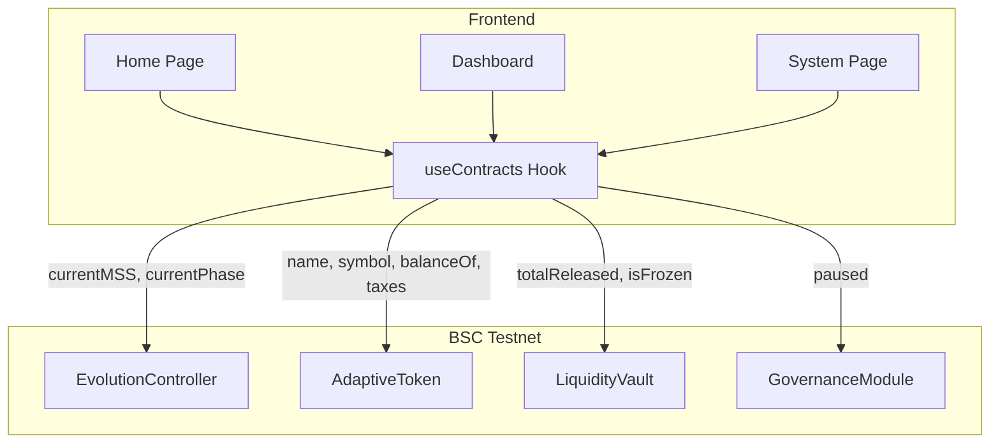

# Smart Contract ↔ Frontend Integration — Walkthrough

## Summary

Connected all 5 deployed EvoLaunch smart contracts to the frontend. Pages now read **real on-chain data** from BSC Testnet — no wallet required for read operations.

## Deployed Contracts

| Contract | Address |
|----------|---------|
| LaunchFactory | `0x4Ab4727c436077cD56652166d32503f959e943Ab` |
| AdaptiveToken | `0xb142FCD1fc79BE3EA60C1B83558f171033A0c12E` |
| LiquidityVault | `0x383D77A86D51313e5C3F6f9feb372191FAEdA4fF` |
| EvolutionController | `0xC4D65495eB47AC8726Dad401d28A83C25B77f110` |
| GovernanceModule | `0xfE63A74EcAC6BCaDF4078B7C53d01e2f511ff629` |
| AMM Pair | `0x6FdFe8B580864A97Ae21f5Ba46046016FC3173DA` |

## Files Created/Modified

### New Files

| File | Purpose |
|------|---------|
| [contracts/index.ts](file:///e:/BNB-Bengaluru/frontend/lib/contracts/index.ts) | All ABIs, addresses, `JsonRpcProvider`, typed data fetchers |
| [useContracts.ts](file:///e:/BNB-Bengaluru/frontend/lib/hooks/useContracts.ts) | React hook — polls all contracts every 30s |
| [global.d.ts](file:///e:/BNB-Bengaluru/frontend/global.d.ts) | TypeScript declaration for `window.ethereum` |
| [.env.local](file:///e:/BNB-Bengaluru/frontend/.env.local) | Token address config |

### Pages Wired to On-Chain Data

| Page | On-Chain Data Read |
|------|-------------------|
| `/` (Home) | MSS from EvolutionController, phase name, token stats from AdaptiveToken, vault frozen status |
| `/dashboard` | User's token balance from AdaptiveToken (when wallet connected), token symbol, current phase |
| `/system` | Real contract connectivity status, MSS value, governance paused state |

## Architecture

## Build

✅ `npm run build` passes with zero errors.
