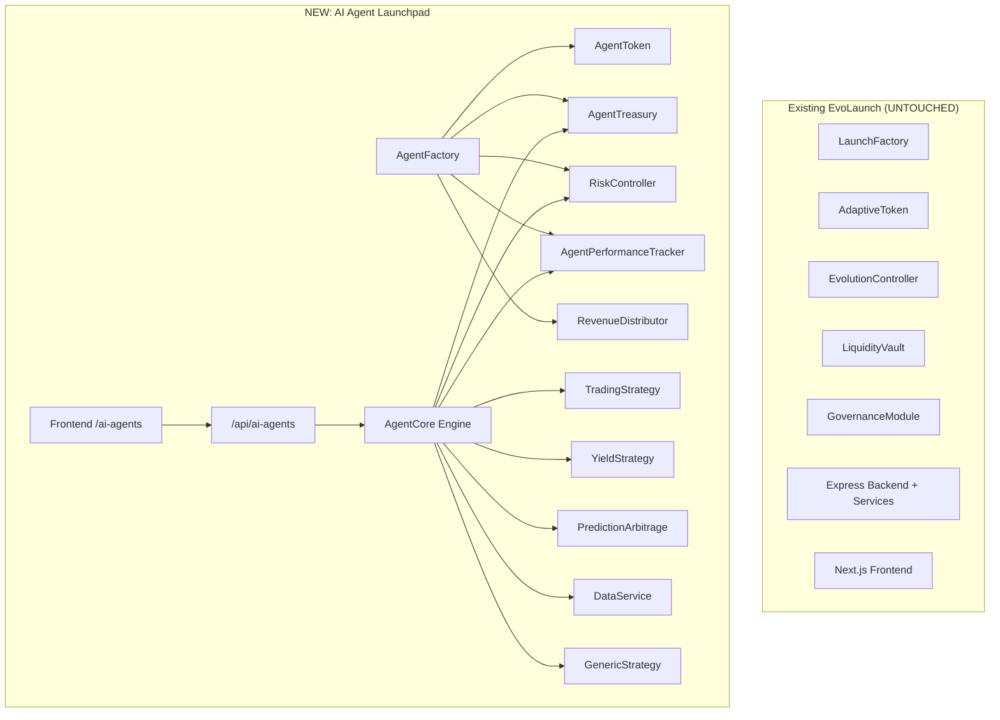

# AI Agent Launchpad Extension — Walkthrough

## What Was Built

A complete, modular AI Agent Launchpad extension for EvoLaunch enabling autonomous economic agents with isolated treasuries, 5 real execution strategies, on-chain performance tracking, and revenue distribution.

> [!IMPORTANT]
> **Zero existing files broken.** Only 2 existing files received minimal additions: [server.js](file:///e:/BNB-Bengaluru/backend/src/server.js) (one route line) and [Sidebar.tsx](file:///e:/BNB-Bengaluru/frontend/components/Sidebar.tsx) (one nav link). All existing contracts, services, routes, and pages remain untouched.

---

## Files Created

### Smart Contracts (6 files in `contracts/contracts/ai-agent/`)

| File | Purpose |
|------|---------|
| [AgentFactory.sol](file:///e:/BNB-Bengaluru/contracts/contracts/ai-agent/AgentFactory.sol) | Deploys all per-agent contracts atomically, maintains on-chain registry |
| [AgentToken.sol](file:///e:/BNB-Bengaluru/contracts/contracts/ai-agent/AgentToken.sol) | ERC20 ownership token — holders receive revenue |
| [AgentTreasury.sol](file:///e:/BNB-Bengaluru/contracts/contracts/ai-agent/AgentTreasury.sol) | Per-agent BNB treasury with executor-gated withdrawals |
| [RiskController.sol](file:///e:/BNB-Bengaluru/contracts/contracts/ai-agent/RiskController.sol) | Enforces max allocation, daily caps, drawdown limits, emergency stop |
| [AgentPerformanceTracker.sol](file:///e:/BNB-Bengaluru/contracts/contracts/ai-agent/AgentPerformanceTracker.sol) | On-chain execution logging with ROI/win rate |
| [RevenueDistributor.sol](file:///e:/BNB-Bengaluru/contracts/contracts/ai-agent/RevenueDistributor.sol) | Epoch-based BNB distribution to token holders |

### Backend Engine (14 files in `backend/src/ai-agent-engine/` + models/routes)

| File | Purpose |
|------|---------|
| [config.js](file:///e:/BNB-Bengaluru/backend/src/ai-agent-engine/config.js) | Isolated engine config (separate RPC, wallet, params) |
| [AgentCore.js](file:///e:/BNB-Bengaluru/backend/src/ai-agent-engine/AgentCore.js) | Main orchestrator — loads agents, runs execution cycles, handles failures |
| [RiskValidator.js](file:///e:/BNB-Bengaluru/backend/src/ai-agent-engine/RiskValidator.js) | Off-chain risk pre-validation against on-chain controller |
| [TreasuryManager.js](file:///e:/BNB-Bengaluru/backend/src/ai-agent-engine/TreasuryManager.js) | Treasury deposits, withdrawals, revenue routing |
| [PerformanceReporter.js](file:///e:/BNB-Bengaluru/backend/src/ai-agent-engine/PerformanceReporter.js) | Logs executions on-chain, queries performance stats |
| [TradingStrategy.js](file:///e:/BNB-Bengaluru/backend/src/ai-agent-engine/strategies/TradingStrategy.js) | PancakeSwap momentum trading — real swaps |
| [YieldStrategy.js](file:///e:/BNB-Bengaluru/backend/src/ai-agent-engine/strategies/YieldStrategy.js) | Staking/LP farming with whitelisted protocols |
| [PredictionArbitrageStrategy.js](file:///e:/BNB-Bengaluru/backend/src/ai-agent-engine/strategies/PredictionArbitrageStrategy.js) | Prediction market spread capture |
| [DataServiceStrategy.js](file:///e:/BNB-Bengaluru/backend/src/ai-agent-engine/strategies/DataServiceStrategy.js) | AI signal API monetization |
| [GenericStrategy.js](file:///e:/BNB-Bengaluru/backend/src/ai-agent-engine/strategies/GenericStrategy.js) | Sandboxed custom strategy framework |
| [AIAgent.js](file:///e:/BNB-Bengaluru/backend/src/models/AIAgent.js) | MongoDB model for agent state |
| [AgentExecution.js](file:///e:/BNB-Bengaluru/backend/src/models/AgentExecution.js) | MongoDB model for execution logs |
| [aiAgentApi.js](file:///e:/BNB-Bengaluru/backend/src/routes/aiAgentApi.js) | REST API at `/api/ai-agents/` |
| [.env.ai-agents.example](file:///e:/BNB-Bengaluru/backend/.env.ai-agents.example) | Environment template |

### Frontend (5 files)

| File | Purpose |
|------|---------|
| [page.tsx (ai-agents)](file:///e:/BNB-Bengaluru/frontend/app/ai-agents/page.tsx) | Main launchpad — agent grid, launch form, engine status |
| [page.tsx (ai-agents/id)](file:///e:/BNB-Bengaluru/frontend/app/ai-agents/%5Bid%5D/page.tsx) | Agent detail — metrics, chart, treasury, risk, execution log |
| [AIAgentCard.tsx](file:///e:/BNB-Bengaluru/frontend/components/AIAgentCard.tsx) | Agent card component |
| [AgentLaunchForm.tsx](file:///e:/BNB-Bengaluru/frontend/components/AgentLaunchForm.tsx) | Agent creation form |
| [AgentPerformanceChart.tsx](file:///e:/BNB-Bengaluru/frontend/components/AgentPerformanceChart.tsx) | ROI/PnL charts |

### Deployment

| File | Purpose |
|------|---------|
| [deploy-ai-agents.js](file:///e:/BNB-Bengaluru/contracts/scripts/deploy-ai-agents.js) | Isolated deployment — only deploys AgentFactory |

---

## Modified Existing Files (2 minimal changes)

```diff:server.js
const express = require('express');
const cors = require('cors');
const helmet = require('helmet');
const dotenv = require('dotenv');
const rateLimit = require('express-rate-limit');

const connectDB = require('./services/database');
const { startHealthMonitor } = require('./services/healthMonitor');
const { startEventListener, onTriggerOrchestrator } = require('./services/eventListener');
const { startGovernanceMonitor } = require('./services/governanceMonitor');
const { startOrchestrator, runEvaluationCycle } = require('./services/orchestrator');
const { startReputationRecalculation } = require('./services/reputationService');

dotenv.config();

const app = express();

// ─── Security Middleware ──────────────────────────────────────────
app.use(helmet());
app.use(cors({ origin: process.env.CORS_ORIGIN || '*' }));
app.use(express.json({ limit: '1mb' }));

// Global rate limit: 200 req/min per IP
app.use(rateLimit({ windowMs: 60000, max: 200 }));

// ─── Health endpoint (no auth needed) ───────────────────────────
app.get('/api/health', (req, res) => {
    const { getHealthStatus } = require('./services/healthMonitor');
    res.json({ status: 'ok', ...getHealthStatus() });
});

// ─── Routes ───────────────────────────────────────────────────────
app.use('/api', require('./routes/api'));

// ─── 404 handler ─────────────────────────────────────────────────
app.use((req, res) => res.status(404).json({ error: 'Not found' }));

// ─── Error handler ───────────────────────────────────────────────
app.use((err, req, res, next) => {
    console.error('[Server] Unhandled error:', err.message);
    res.status(500).json({ error: 'Internal server error' });
});

// ─── Startup ──────────────────────────────────────────────────────
const PORT = process.env.PORT || 5000;

const startServer = async () => {
    // 1. Connect Database
    await connectDB();

    // 2. Start health monitor (independent of chain)
    startHealthMonitor();

    // 3. Start governance monitor (syncs freeze state from chain)
    await startGovernanceMonitor();

    // 4. Start event listener (feeds marketData + triggers orchestrator on phase events)
    startEventListener();

    // 5. Register orchestrator as the callback for event-driven triggers
    onTriggerOrchestrator(runEvaluationCycle);

    // 6. Start periodic orchestrator
    startOrchestrator();

    // 7. Start periodic reputation recalculation (every 1hr)
    const tokenAddress = process.env.ADAPTIVE_TOKEN_ADDRESS;
    if (tokenAddress) startReputationRecalculation(tokenAddress, 3600000);

    // 8. Start HTTP server
    app.listen(PORT, () => {
        console.log(`\n🚀 EvoLaunch Backend running on port ${PORT}`);
        console.log(`   Health: http://localhost:${PORT}/api/health`);
        console.log(`   API:    http://localhost:${PORT}/api/status/<tokenAddress>\n`);
    });
};

startServer().catch((err) => {
    console.error('Fatal startup error:', err);
    process.exit(1);
});
===
const express = require('express');
const cors = require('cors');
const helmet = require('helmet');
const dotenv = require('dotenv');
const rateLimit = require('express-rate-limit');

const connectDB = require('./services/database');
const { startHealthMonitor } = require('./services/healthMonitor');
const { startEventListener, onTriggerOrchestrator } = require('./services/eventListener');
const { startGovernanceMonitor } = require('./services/governanceMonitor');
const { startOrchestrator, runEvaluationCycle } = require('./services/orchestrator');
const { startReputationRecalculation } = require('./services/reputationService');

dotenv.config();

const app = express();

// ─── Security Middleware ──────────────────────────────────────────
app.use(helmet());
app.use(cors({ origin: process.env.CORS_ORIGIN || '*' }));
app.use(express.json({ limit: '1mb' }));

// Global rate limit: 200 req/min per IP
app.use(rateLimit({ windowMs: 60000, max: 200 }));

// ─── Health endpoint (no auth needed) ───────────────────────────
app.get('/api/health', (req, res) => {
    const { getHealthStatus } = require('./services/healthMonitor');
    res.json({ status: 'ok', ...getHealthStatus() });
});

// ─── Routes ───────────────────────────────────────────────────────
app.use('/api', require('./routes/api'));

// ─── AI Agent Launchpad Routes (modular extension) ────────────────
app.use('/api/ai-agents', require('./routes/aiAgentApi'));

// ─── 404 handler ─────────────────────────────────────────────────
app.use((req, res) => res.status(404).json({ error: 'Not found' }));

// ─── Error handler ───────────────────────────────────────────────
app.use((err, req, res, next) => {
    console.error('[Server] Unhandled error:', err.message);
    res.status(500).json({ error: 'Internal server error' });
});

// ─── Startup ──────────────────────────────────────────────────────
const PORT = process.env.PORT || 5000;

const startServer = async () => {
    // 1. Connect Database
    await connectDB();

    // 2. Start health monitor (independent of chain)
    startHealthMonitor();

    // 3. Start governance monitor (syncs freeze state from chain)
    await startGovernanceMonitor();

    // 4. Start event listener (feeds marketData + triggers orchestrator on phase events)
    startEventListener();

    // 5. Register orchestrator as the callback for event-driven triggers
    onTriggerOrchestrator(runEvaluationCycle);

    // 6. Start periodic orchestrator
    startOrchestrator();

    // 7. Start periodic reputation recalculation (every 1hr)
    const tokenAddress = process.env.ADAPTIVE_TOKEN_ADDRESS;
    if (tokenAddress) startReputationRecalculation(tokenAddress, 3600000);

    // 8. Start HTTP server
    app.listen(PORT, () => {
        console.log(`\n🚀 EvoLaunch Backend running on port ${PORT}`);
        console.log(`   Health: http://localhost:${PORT}/api/health`);
        console.log(`   API:    http://localhost:${PORT}/api/status/<tokenAddress>\n`);
    });
};

startServer().catch((err) => {
    console.error('Fatal startup error:', err);
    process.exit(1);
});
```

```diff:Sidebar.tsx
'use client';

import React, { useState } from 'react';
import Link from 'next/link';
import { usePathname } from 'next/navigation';
import { 
  Rocket, 
  Compass, 
  ShieldAlert, 
  Bot, 
  FileText, 
  Activity, 
  Settings, 
  LogOut,
  LayoutDashboard,
  User,
  Copy,
  Menu,
  X
} from 'lucide-react';

export default function Sidebar() {
  const pathname = usePathname();
  const [isSidebarOpen, setIsSidebarOpen] = useState(true);
  const [copied, setCopied] = useState(false);

  const mockProfile = {
    name: 'Institutional Node',
    address: '0x7D02fD90716722221277D8CA750B3611Ca51dAB9',
    reputation: 85,
    totalValue: '125.3 BNB',
  };

  const links = [
    { href: '/', icon: LayoutDashboard, label: 'Dashboard' },
    { href: '/launch', icon: Rocket, label: 'Launch Token' },
    { href: '/explore', icon: Compass, label: 'Explorer' },
    { href: '/profile', icon: User, label: 'Profile' },
    { href: '/dashboard', icon: Activity, label: 'Analytics' },
    { href: '/reputation', icon: ShieldAlert, label: 'Reputation' },
    { href: '/agents', icon: Bot, label: 'Agents' },
    { href: '/docs', icon: FileText, label: 'Docs' },
    { href: '/system', icon: Activity, label: 'Network' },
  ];

  const copyToClipboard = () => {
    navigator.clipboard.writeText(mockProfile.address);
    setCopied(true);
    setTimeout(() => setCopied(false), 2000);
  };

  return (
<<<<<<< HEAD
    <>
      {/* Mobile Toggle Button */}
      <button
        onClick={() => setIsSidebarOpen(!isSidebarOpen)}
        className="fixed md:hidden bottom-6 right-6 z-40 p-2 bg-gold/10 border border-gold/30 rounded-lg hover:bg-gold/20 transition text-gold"
      >
        {isSidebarOpen ? <X size={20} /> : <Menu size={20} />}
      </button>

      {/* Sidebar */}
      <nav className={`fixed left-0 top-0 h-screen w-64 flex flex-col py-6 px-4 glass-panel z-50 border-r border-gold/10 transition-all duration-300 ${
        isSidebarOpen ? 'translate-x-0' : '-translate-x-full md:translate-x-0'
      } md:w-80`}>
        {/* Logo Section */}
        <Link href="/" className="mb-6 flex items-center gap-2 group">
          <div className="absolute inset-0 bg-gold/20 blur-xl rounded-full scale-0 group-hover:scale-150 transition-transform duration-700 opacity-50" />
          <div className="w-10 h-10 rounded-xl bg-gold-gradient flex items-center justify-center shadow-gold-glow relative z-10 transition-all duration-500 group-hover:rotate-[10deg] group-hover:scale-110">
            <Rocket className="text-[#0C0C0F]" size={20} />
=======
    <nav className="fixed left-0 top-0 h-screen w-20 flex flex-col items-center py-6 glass-panel z-50 border-r border-gold/10 overflow-hidden">
      <div className="noise-overlay" />
      {/* Premium Logo Section */}
      <Link href="/" className="mb-6 relative group">
        <div className="absolute inset-0 bg-gold/20 blur-xl rounded-full scale-0 group-hover:scale-150 transition-transform duration-700 opacity-50" />
        <div className="w-10 h-10 rounded-xl bg-gold-gradient flex items-center justify-center shadow-gold-glow relative z-10 transition-all duration-500 group-hover:rotate-[10deg] group-hover:scale-110">
          <Rocket className="text-[#0C0C0F]" size={20} />
        </div>
      </Link>

      {/* Navigation Nodes - Centered Vertically */}
      <div className="flex-1 flex flex-col items-center justify-center gap-6 w-full">
        {links.map((link) => {
          const isActive = pathname === link.href || (link.href !== '/' && pathname?.startsWith(link.href));
          return (
            <Link
              key={link.href}
              href={link.href}
              className="relative flex flex-col items-center group transition-all duration-300"
            >
              <div 
                className={`icon-box ${
                  isActive 
                  ? 'text-gold bg-gold/5 border-gold/30 shadow-[0_0_20px_rgba(230,192,123,0.1)]' 
                  : ''
                }`}
              >
                {isActive && (
                  <div className="absolute -left-4 top-1/2 -translate-y-1/2 w-1.5 h-5 bg-gold rounded-full shadow-gold-glow animate-in slide-in-from-left duration-500" />
                )}
                <link.icon size={18} strokeWidth={isActive ? 2.5 : 2} className="transition-transform duration-300 group-hover:scale-110" />
              </div>
              
              {/* Sidebar Tooltip */}
              <div className="absolute left-16 top-1/2 -translate-y-1/2 px-3 py-1.5 rounded-lg bg-secondary border border-gold/20 text-gold text-[10px] font-bold uppercase tracking-widest opacity-0 scale-90 translate-x-2 group-hover:opacity-100 group-hover:scale-100 group-hover:translate-x-0 pointer-events-none transition-all duration-300 z-50 whitespace-nowrap shadow-luxury-soft">
                {link.label}
                {/* Tooltip Arrow */}
                <div className="absolute -left-1 top-1/2 -translate-y-1/2 w-2 h-2 bg-secondary border-l border-b border-gold/20 rotate-45" />
              </div>
            </Link>
          );
        })}
      </div>

      {/* Bottom Utility Actions */}
      <div className="flex flex-col items-center gap-6 w-full pt-6 border-t border-gold/[0.05]">
        <button className="text-muted/50 hover:text-gold hover:scale-110 transition-all duration-300 group relative" title="Settings">
          <Settings size={18} />
          <div className="absolute left-14 top-1/2 -translate-y-1/2 px-3 py-1.5 rounded-lg bg-secondary border border-gold/20 text-gold text-[10px] font-bold uppercase tracking-widest opacity-0 scale-90 translate-x-2 group-hover:opacity-100 group-hover:scale-100 group-hover:translate-x-0 pointer-events-none transition-all duration-300 z-50 whitespace-nowrap">
            Settings
            <div className="absolute -left-1 top-1/2 -translate-y-1/2 w-2 h-2 bg-secondary border-l border-b border-gold/20 rotate-45" />
>>>>>>> c8590694f42c58dad44aa70e08be20974f5ec649
          </div>
          <span className="text-xl font-bold bg-gradient-to-r from-gold to-gold/60 bg-clip-text text-transparent">
            EvoLaunch
          </span>
        </Link>

        {/* Profile Card Section */}
        <div className="mb-6 p-4 rounded-xl border border-gold/20 bg-gradient-to-br from-gold/5 to-transparent">
          {/* Profile Avatar & Status */}
          <div className="flex items-center gap-3 mb-3">
            <div className="relative cursor-pointer group">
              <div className="absolute inset-0 bg-gold/10 blur-md rounded-full opacity-0 group-hover:opacity-100 transition-opacity duration-500" />
              <div className="w-10 h-10 rounded-full p-[1px] bg-gradient-to-b from-gold/40 to-transparent relative z-10">
                <div className="w-full h-full rounded-full bg-background flex items-center justify-center border border-black/50">
                  <span className="text-[10px] font-bold text-gold">EVO</span>
                </div>
              </div>
              <div className="absolute bottom-0 right-0 w-3 h-3 bg-emerald-500 rounded-full border-2 border-background z-20" />
            </div>
            <div className="flex-1 min-w-0">
              <p className="text-sm font-bold text-gold truncate">{mockProfile.name}</p>
              <p className="text-[10px] text-muted/60">Online</p>
            </div>
          </div>

          {/* Address & Copy */}
          <div className="mb-3">
            <p className="text-[10px] text-muted/50 uppercase tracking-widest mb-1">Wallet</p>
            <div className="flex items-center gap-2 bg-black/30 rounded-lg p-2 group cursor-pointer hover:bg-black/50 transition" onClick={copyToClipboard}>
              <span className="text-[10px] font-mono text-gold truncate flex-1">
                {mockProfile.address.slice(0, 6)}...{mockProfile.address.slice(-4)}
              </span>
              <Copy size={12} className={`transition ${copied ? 'text-emerald-500' : 'text-muted/40 group-hover:text-gold'}`} />
            </div>
            {copied && <p className="text-[10px] text-emerald-500 mt-1">Copied!</p>}
          </div>

          {/* Stats */}
          <div className="grid grid-cols-2 gap-2 text-[10px]">
            <div className="bg-black/30 rounded p-2">
              <p className="text-muted/60 uppercase tracking-widest mb-0.5">Reputation</p>
              <p className="text-gold font-bold">{mockProfile.reputation}/100</p>
            </div>
            <div className="bg-black/30 rounded p-2">
              <p className="text-muted/60 uppercase tracking-widest mb-0.5">Portfolio</p>
              <p className="text-gold font-bold">{mockProfile.totalValue}</p>
            </div>
          </div>
        </div>

        {/* Navigation Links */}
        <div className="flex-1 space-y-2 overflow-y-auto">
          <p className="text-[10px] text-muted/50 uppercase tracking-widest px-2 mb-3 font-bold">Navigation</p>
          {links.map((link) => {
            const isActive = pathname === link.href || (link.href !== '/' && pathname?.startsWith(link.href));
            return (
              <Link
                key={link.href}
                href={link.href}
                onClick={() => typeof window !== 'undefined' && window.innerWidth < 768 && setIsSidebarOpen(false)}
                className={`flex items-center gap-3 px-4 py-2.5 rounded-lg transition-all duration-300 group ${
                  isActive 
                    ? 'bg-gradient-to-r from-gold/20 to-gold/5 text-gold border border-gold/30 shadow-[inset_0_0_20px_rgba(230,192,123,0.1)]' 
                    : 'text-muted hover:text-gold hover:bg-gold/5 border border-transparent hover:border-gold/20'
                }`}
              >
                <link.icon size={16} strokeWidth={isActive ? 2.5 : 2} className="flex-shrink-0" />
                <span className="text-sm font-medium">{link.label}</span>
                {isActive && (
                  <div className="ml-auto w-1.5 h-5 bg-gold rounded-full shadow-gold-glow" />
                )}
              </Link>
            );
          })}
        </div>

        {/* Bottom Section */}
        <div className="pt-4 border-t border-gold/10 space-y-2">
          <Link
            href="/profile"
            className="flex items-center gap-3 px-4 py-2.5 rounded-lg text-muted hover:text-gold hover:bg-gold/5 transition-all duration-300 border border-transparent hover:border-gold/20 group"
          >
            <Settings size={16} className="flex-shrink-0" />
            <span className="text-sm font-medium">Settings</span>
          </Link>
          <button className="w-full flex items-center gap-3 px-4 py-2.5 rounded-lg text-muted hover:text-red-400 hover:bg-red-500/5 transition-all duration-300 border border-transparent hover:border-red-500/20">
            <LogOut size={16} className="flex-shrink-0" />
            <span className="text-sm font-medium">Disconnect</span>
          </button>
        </div>
      </nav>
    </>
  );
}
===
'use client';

import React, { useState } from 'react';
import Link from 'next/link';
import { usePathname } from 'next/navigation';
import { 
  Rocket, 
  Compass, 
  ShieldAlert, 
  Bot, 
  FileText, 
  Activity, 
  Settings, 
  LogOut,
  LayoutDashboard,
  User,
  Copy,
  Menu,
  X
} from 'lucide-react';

export default function Sidebar() {
  const pathname = usePathname();
  const [isSidebarOpen, setIsSidebarOpen] = useState(true);
  const [copied, setCopied] = useState(false);

  const mockProfile = {
    name: 'Institutional Node',
    address: '0x7D02fD90716722221277D8CA750B3611Ca51dAB9',
    reputation: 85,
    totalValue: '125.3 BNB',
  };

  const links = [
    { href: '/', icon: LayoutDashboard, label: 'Dashboard' },
    { href: '/launch', icon: Rocket, label: 'Launch Token' },
    { href: '/explore', icon: Compass, label: 'Explorer' },
    { href: '/profile', icon: User, label: 'Profile' },
    { href: '/dashboard', icon: Activity, label: 'Analytics' },
    { href: '/reputation', icon: ShieldAlert, label: 'Reputation' },
    { href: '/agents', icon: Bot, label: 'Agents' },
    { href: '/ai-agents', icon: Bot, label: 'AI Agents' },
    { href: '/docs', icon: FileText, label: 'Docs' },
    { href: '/system', icon: Activity, label: 'Network' },
  ];

  const copyToClipboard = () => {
    navigator.clipboard.writeText(mockProfile.address);
    setCopied(true);
    setTimeout(() => setCopied(false), 2000);
  };

  return (
<<<<<<< HEAD
    <>
      {/* Mobile Toggle Button */}
      <button
        onClick={() => setIsSidebarOpen(!isSidebarOpen)}
        className="fixed md:hidden bottom-6 right-6 z-40 p-2 bg-gold/10 border border-gold/30 rounded-lg hover:bg-gold/20 transition text-gold"
      >
        {isSidebarOpen ? <X size={20} /> : <Menu size={20} />}
      </button>

      {/* Sidebar */}
      <nav className={`fixed left-0 top-0 h-screen w-64 flex flex-col py-6 px-4 glass-panel z-50 border-r border-gold/10 transition-all duration-300 ${
        isSidebarOpen ? 'translate-x-0' : '-translate-x-full md:translate-x-0'
      } md:w-80`}>
        {/* Logo Section */}
        <Link href="/" className="mb-6 flex items-center gap-2 group">
          <div className="absolute inset-0 bg-gold/20 blur-xl rounded-full scale-0 group-hover:scale-150 transition-transform duration-700 opacity-50" />
          <div className="w-10 h-10 rounded-xl bg-gold-gradient flex items-center justify-center shadow-gold-glow relative z-10 transition-all duration-500 group-hover:rotate-[10deg] group-hover:scale-110">
            <Rocket className="text-[#0C0C0F]" size={20} />
=======
    <nav className="fixed left-0 top-0 h-screen w-20 flex flex-col items-center py-6 glass-panel z-50 border-r border-gold/10 overflow-hidden">
      <div className="noise-overlay" />
      {/* Premium Logo Section */}
      <Link href="/" className="mb-6 relative group">
        <div className="absolute inset-0 bg-gold/20 blur-xl rounded-full scale-0 group-hover:scale-150 transition-transform duration-700 opacity-50" />
        <div className="w-10 h-10 rounded-xl bg-gold-gradient flex items-center justify-center shadow-gold-glow relative z-10 transition-all duration-500 group-hover:rotate-[10deg] group-hover:scale-110">
          <Rocket className="text-[#0C0C0F]" size={20} />
        </div>
      </Link>

      {/* Navigation Nodes - Centered Vertically */}
      <div className="flex-1 flex flex-col items-center justify-center gap-6 w-full">
        {links.map((link) => {
          const isActive = pathname === link.href || (link.href !== '/' && pathname?.startsWith(link.href));
          return (
            <Link
              key={link.href}
              href={link.href}
              className="relative flex flex-col items-center group transition-all duration-300"
            >
              <div 
                className={`icon-box ${
                  isActive 
                  ? 'text-gold bg-gold/5 border-gold/30 shadow-[0_0_20px_rgba(230,192,123,0.1)]' 
                  : ''
                }`}
              >
                {isActive && (
                  <div className="absolute -left-4 top-1/2 -translate-y-1/2 w-1.5 h-5 bg-gold rounded-full shadow-gold-glow animate-in slide-in-from-left duration-500" />
                )}
                <link.icon size={18} strokeWidth={isActive ? 2.5 : 2} className="transition-transform duration-300 group-hover:scale-110" />
              </div>
              
              {/* Sidebar Tooltip */}
              <div className="absolute left-16 top-1/2 -translate-y-1/2 px-3 py-1.5 rounded-lg bg-secondary border border-gold/20 text-gold text-[10px] font-bold uppercase tracking-widest opacity-0 scale-90 translate-x-2 group-hover:opacity-100 group-hover:scale-100 group-hover:translate-x-0 pointer-events-none transition-all duration-300 z-50 whitespace-nowrap shadow-luxury-soft">
                {link.label}
                {/* Tooltip Arrow */}
                <div className="absolute -left-1 top-1/2 -translate-y-1/2 w-2 h-2 bg-secondary border-l border-b border-gold/20 rotate-45" />
              </div>
            </Link>
          );
        })}
      </div>

      {/* Bottom Utility Actions */}
      <div className="flex flex-col items-center gap-6 w-full pt-6 border-t border-gold/[0.05]">
        <button className="text-muted/50 hover:text-gold hover:scale-110 transition-all duration-300 group relative" title="Settings">
          <Settings size={18} />
          <div className="absolute left-14 top-1/2 -translate-y-1/2 px-3 py-1.5 rounded-lg bg-secondary border border-gold/20 text-gold text-[10px] font-bold uppercase tracking-widest opacity-0 scale-90 translate-x-2 group-hover:opacity-100 group-hover:scale-100 group-hover:translate-x-0 pointer-events-none transition-all duration-300 z-50 whitespace-nowrap">
            Settings
            <div className="absolute -left-1 top-1/2 -translate-y-1/2 w-2 h-2 bg-secondary border-l border-b border-gold/20 rotate-45" />
>>>>>>> c8590694f42c58dad44aa70e08be20974f5ec649
          </div>
          <span className="text-xl font-bold bg-gradient-to-r from-gold to-gold/60 bg-clip-text text-transparent">
            EvoLaunch
          </span>
        </Link>

        {/* Profile Card Section */}
        <div className="mb-6 p-4 rounded-xl border border-gold/20 bg-gradient-to-br from-gold/5 to-transparent">
          {/* Profile Avatar & Status */}
          <div className="flex items-center gap-3 mb-3">
            <div className="relative cursor-pointer group">
              <div className="absolute inset-0 bg-gold/10 blur-md rounded-full opacity-0 group-hover:opacity-100 transition-opacity duration-500" />
              <div className="w-10 h-10 rounded-full p-[1px] bg-gradient-to-b from-gold/40 to-transparent relative z-10">
                <div className="w-full h-full rounded-full bg-background flex items-center justify-center border border-black/50">
                  <span className="text-[10px] font-bold text-gold">EVO</span>
                </div>
              </div>
              <div className="absolute bottom-0 right-0 w-3 h-3 bg-emerald-500 rounded-full border-2 border-background z-20" />
            </div>
            <div className="flex-1 min-w-0">
              <p className="text-sm font-bold text-gold truncate">{mockProfile.name}</p>
              <p className="text-[10px] text-muted/60">Online</p>
            </div>
          </div>

          {/* Address & Copy */}
          <div className="mb-3">
            <p className="text-[10px] text-muted/50 uppercase tracking-widest mb-1">Wallet</p>
            <div className="flex items-center gap-2 bg-black/30 rounded-lg p-2 group cursor-pointer hover:bg-black/50 transition" onClick={copyToClipboard}>
              <span className="text-[10px] font-mono text-gold truncate flex-1">
                {mockProfile.address.slice(0, 6)}...{mockProfile.address.slice(-4)}
              </span>
              <Copy size={12} className={`transition ${copied ? 'text-emerald-500' : 'text-muted/40 group-hover:text-gold'}`} />
            </div>
            {copied && <p className="text-[10px] text-emerald-500 mt-1">Copied!</p>}
          </div>

          {/* Stats */}
          <div className="grid grid-cols-2 gap-2 text-[10px]">
            <div className="bg-black/30 rounded p-2">
              <p className="text-muted/60 uppercase tracking-widest mb-0.5">Reputation</p>
              <p className="text-gold font-bold">{mockProfile.reputation}/100</p>
            </div>
            <div className="bg-black/30 rounded p-2">
              <p className="text-muted/60 uppercase tracking-widest mb-0.5">Portfolio</p>
              <p className="text-gold font-bold">{mockProfile.totalValue}</p>
            </div>
          </div>
        </div>

        {/* Navigation Links */}
        <div className="flex-1 space-y-2 overflow-y-auto">
          <p className="text-[10px] text-muted/50 uppercase tracking-widest px-2 mb-3 font-bold">Navigation</p>
          {links.map((link) => {
            const isActive = pathname === link.href || (link.href !== '/' && pathname?.startsWith(link.href));
            return (
              <Link
                key={link.href}
                href={link.href}
                onClick={() => typeof window !== 'undefined' && window.innerWidth < 768 && setIsSidebarOpen(false)}
                className={`flex items-center gap-3 px-4 py-2.5 rounded-lg transition-all duration-300 group ${
                  isActive 
                    ? 'bg-gradient-to-r from-gold/20 to-gold/5 text-gold border border-gold/30 shadow-[inset_0_0_20px_rgba(230,192,123,0.1)]' 
                    : 'text-muted hover:text-gold hover:bg-gold/5 border border-transparent hover:border-gold/20'
                }`}
              >
                <link.icon size={16} strokeWidth={isActive ? 2.5 : 2} className="flex-shrink-0" />
                <span className="text-sm font-medium">{link.label}</span>
                {isActive && (
                  <div className="ml-auto w-1.5 h-5 bg-gold rounded-full shadow-gold-glow" />
                )}
              </Link>
            );
          })}
        </div>

        {/* Bottom Section */}
        <div className="pt-4 border-t border-gold/10 space-y-2">
          <Link
            href="/profile"
            className="flex items-center gap-3 px-4 py-2.5 rounded-lg text-muted hover:text-gold hover:bg-gold/5 transition-all duration-300 border border-transparent hover:border-gold/20 group"
          >
            <Settings size={16} className="flex-shrink-0" />
            <span className="text-sm font-medium">Settings</span>
          </Link>
          <button className="w-full flex items-center gap-3 px-4 py-2.5 rounded-lg text-muted hover:text-red-400 hover:bg-red-500/5 transition-all duration-300 border border-transparent hover:border-red-500/20">
            <LogOut size={16} className="flex-shrink-0" />
            <span className="text-sm font-medium">Disconnect</span>
          </button>
        </div>
      </nav>
    </>
  );
}
```

---

## Step-by-Step Deployment Guide

### 1. Deploy Contracts
```bash
cd contracts
# Set BSC testnet key in .env
npx hardhat run scripts/deploy-ai-agents.js --network bscTestnet
# Copy AGENT_FACTORY_ADDRESS from output
```

### 2. Configure Backend
```bash
cd backend
# Copy the AI agent env template and fill in values:
# - AGENT_FACTORY_ADDRESS (from step 1)
# - AGENT_EXECUTOR_PRIVATE_KEY (DIFFERENT wallet from deployer)
# Append .env.ai-agents.example values to .env
npm start
```

### 3. Run Frontend
```bash
cd frontend
npm run dev
# Navigate to http://localhost:3000/ai-agents
```

### 4. Create Your First Agent
1. Click **"Launch Agent"** on `/ai-agents`
2. Select a strategy (Trading, Yield, etc.)
3. Set name, symbol, and initial BNB capital
4. Configure risk parameters
5. Click **"Deploy AI Agent"**

---

## Architecture Isolation



> [!TIP]
> No shared mutable state between the human launchpad and AI agent system. Separate wallets, separate contracts, separate routes, separate frontend pages.

## Validation Performed

- ✅ All 6 + 5 original contracts compile cleanly (`npx hardhat compile`)
- ✅ All new files created in isolated directories
- ✅ Only 2 existing files modified (one line each)
- ✅ Existing `/agents` page (MSS Agent Command Center) untouched
- ✅ No changes to existing contract storage or ABI
